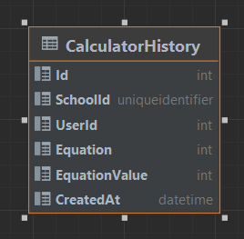

# Calculator

A simple calculator written in Asp.Net 7 with Angular.

## Assumptions
Throughout some assumptions have been made that have been used for various design decisions. 
These typically explain the presence or absence of features:
* Authentication/Authorization has not been implemented
  * It is assumed that there would already be an authentication mechanism for this to plug into
  * The provided school/user IDs will not be verified in terms of presence or whether the
    student is allowed in the school. All data will be stored as needed
* Browser specification
  * It is assumed that only modern browsers are supported (the use of `E2021.string` 
    is an example of where some of the functionality will likely break in older browsers)
* Database Management
  * Due to difficulties in getting Dapper to complete a 'code first' approach, there is an 
    expected table structure that will need to be created. This is referenced below
  * Connection managed through a connection string for simplicity
  
## Configuration
There are several values required for configuration and the application will not start without
some of them.

### CalculatorDataAccessOptions
All options here should go (if in a json) within an object with the name `CalculatorDataAccessOptions`  

|Key|Required|Description|Example|
|---|---|---|---|
|`ConnectionString`|Yes|The connection string to the database. This should connect directly to the database as required|`Server=(localdb)\MSSQLLocalDB;Initial Catalog=master;Integrated Security=True;MultipleActiveResultSets=True;Trust Server Certificate=true;Integrated Security=SSPI`|
|`Schema`|Yes|The name of the schema that contains the target table|`dbo`|
|`TableName`|Yes|The name of the table that will contain the information. This needs to match the table specification below|`CalculatorHistory`|
|`MaximumConnectionRetries`|No|The maximum number of retries on a failed connection - this is only really relevant if the database is not local to the server|`1`|

## Database
The database will need to have the table created, the main reason for this is that the 
entries for the schoolId and the UserId should be foreign keys to other tables. This can't
be predicted without first seeing the DB in question.

If this was to be in charge of creating the table in the DB we would need to have the app check
if the table is present, if not, create it. Though my preference would be
through a pre-generated script that could be copied and run on the DB as part
of the release process.

  
  
``` sql
create schema calc
go

create table calc.CalculatorHistory
(
    SchoolId      uniqueidentifier           not null,
    UserId        int                        not null,
    Equation      varchar(100)               not null,
    EquationValue numeric                    not null,
    CreatedAt     datetime default getdate() not null,
    Id            int identity,
    constraint CalculatorHistory_pk
        primary key (Id, SchoolId, UserId)
)
go
```